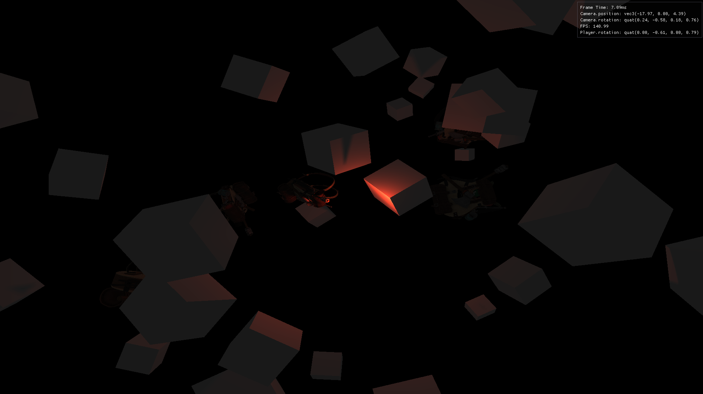

# JAGE

(J)ust (A)nother (G)ame (E)ngine. On its path to be optimized, written by an imbecile. This exists because I want to learn about 3D graphics.
 
## Features

- OpenGL 4.6.0;
- Orthographic and omni directional shadow maps with PCF filtering;
- Support for directional and point lighting;
- Multi draw indirect instanced support ([here's a good article on the subject](https://ktstephano.github.io/rendering/opengl/mdi));
- Entity-Component-System principles for handling game logic;
- Only supports .obj 3d file formats at the moment;
- ImGui fully implemented for editor and debugging tasks;
- Custom logging logic with macros for readability;
- Custom wrapper for OpenGL and relevant data types;
- DSA usage for most of open gl calls.

# End Goals

- Simplistic fps game: move around, shoot things;

## Resources

- [Guy in the couch writing a FPS from scratch while chilling, you probably saw him on Youtube at least once - I trust this guy](https://www.youtube.com/@tokyospliff);
- [Learn Open GL](https://learnopengl.com/)